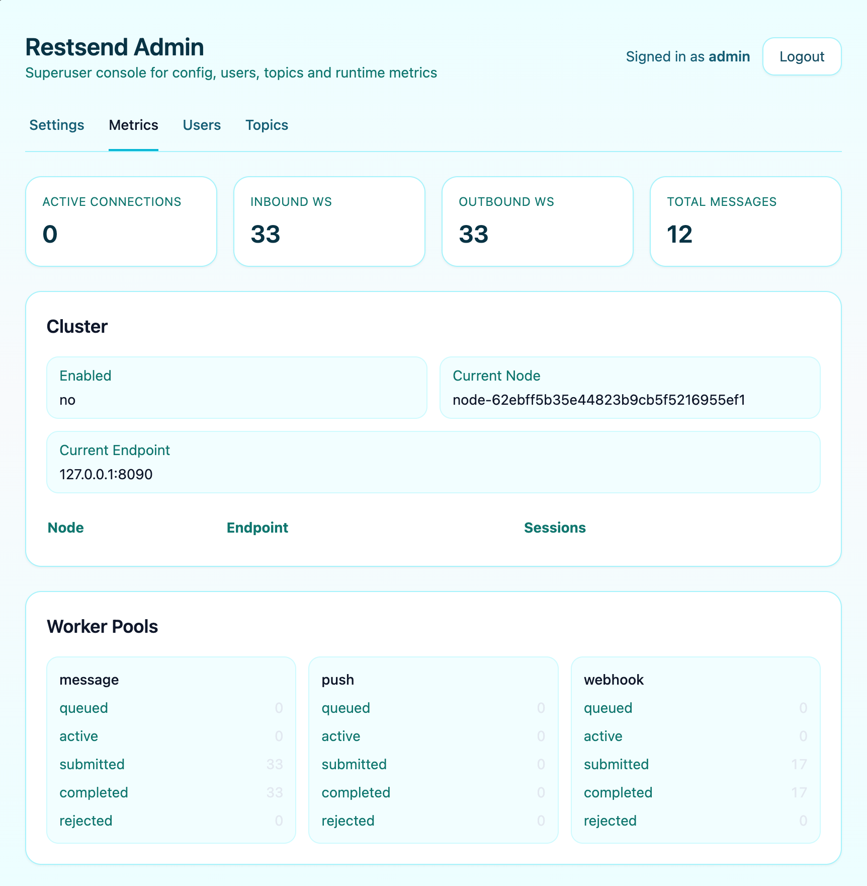
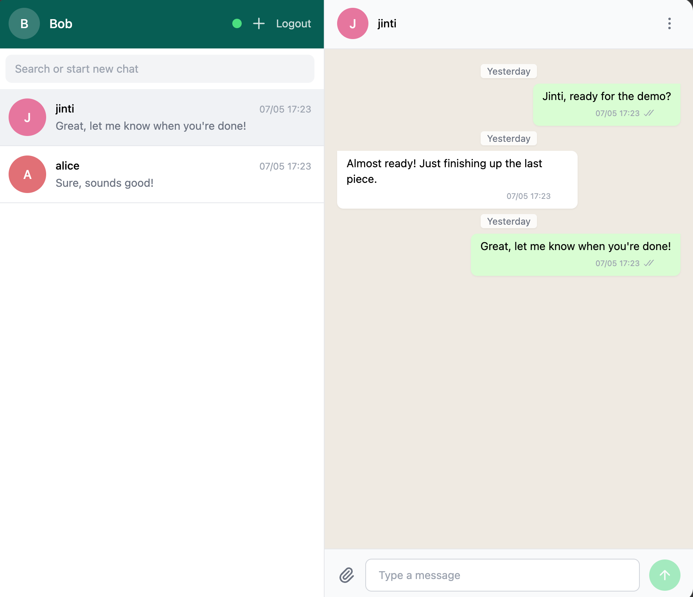

# RestSend

RestSend is a full-featured instant messaging project with backend services, an admin console, a Rust client core, and WASM bindings.



## Crates

- `crates/restsend-backend`: backend service with API, WebSocket, OpenAPI, and Admin
- `crates/restsend`: Rust client core
- `crates/restsend-wasm`: WebAssembly bindings
- `crates/restsend-macros`: internal macros

## Quick Start

```bash
docker run -p 8080:8080 -e RS_DEMO=true ghcr.io/restsend/restsend:latest
```

## Run Backend

Build:

```bash
cargo build -p restsend-backend --release
```

Minimal `.env`:

```env
ADDR=0.0.0.0:8080
DATABASE_URL=sqlite://restsend-server.db?mode=rwc
OPENAPI_PREFIX=/open
API_PREFIX=/api
LOG_FILE=logs/restsend-backend.log
RUN_MIGRATIONS=true
```

Start:

```bash
cargo run -p restsend-backend --release
```

Override listen address by CLI:

```bash
cargo run -p restsend-backend --release -- --addr 127.0.0.1:18080
```

Health check:

```text
GET /api/health
```


## Admin

- Admin page: `/admin`
- First visit can bootstrap the first superuser
- After bootstrap, login with the superuser account

## Notes

- `.env` is loaded via `dotenvy`
- Default database is SQLite
- `RS_PRESENCE_BACKEND=memory` for single node
- `RS_PRESENCE_BACKEND=db` for shared presence across nodes

## Features

- REST API and WebSocket realtime messaging
- Admin console
- OpenAPI integration
- Webhook support
- SQLite / MySQL via SeaORM
- Rust and WASM client support

## License

- MIT, see `LICENSE`
- Commercial license required for production deployments serving more than 1000 users

Contact: `kui@fourz.cn`
