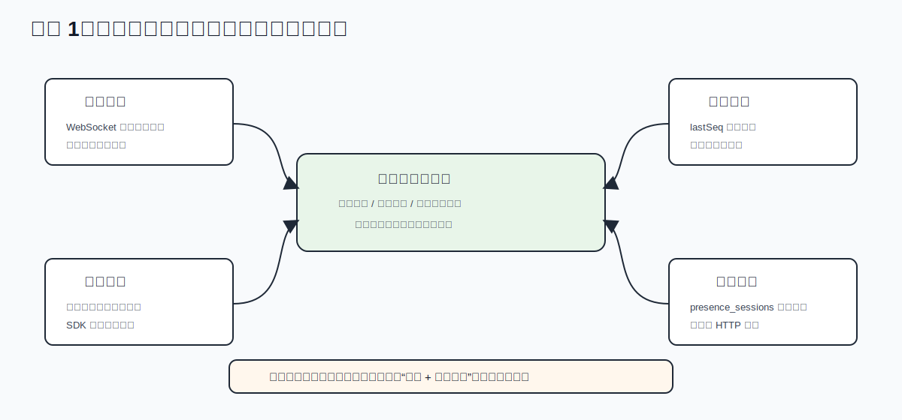
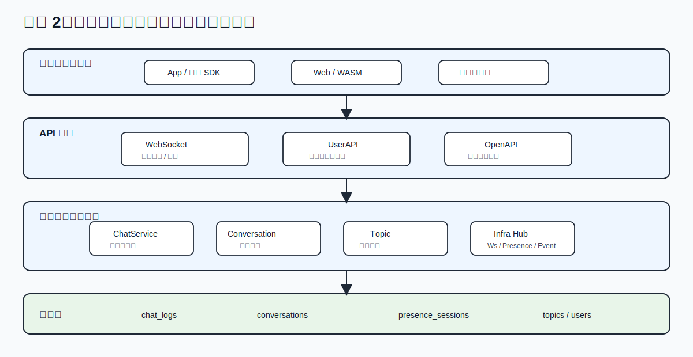
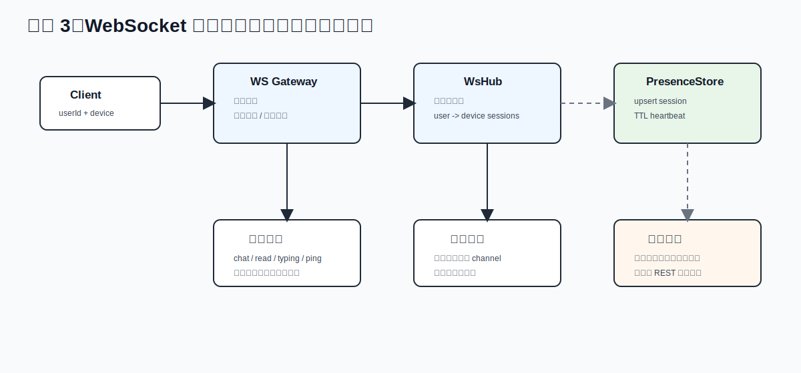
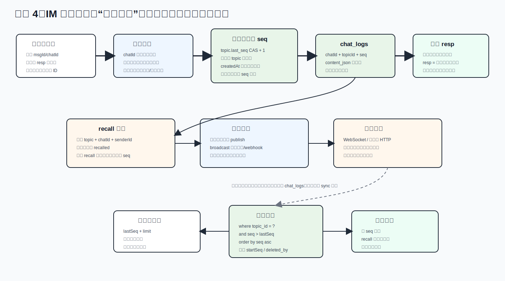
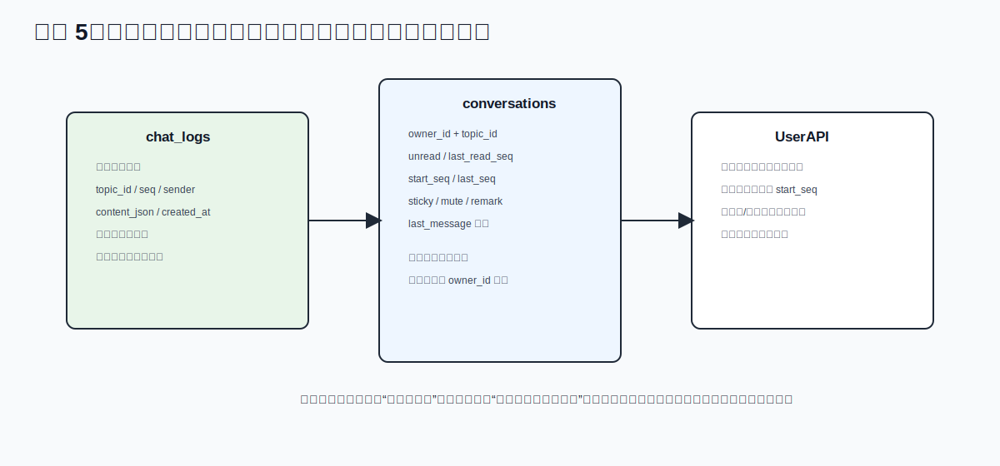
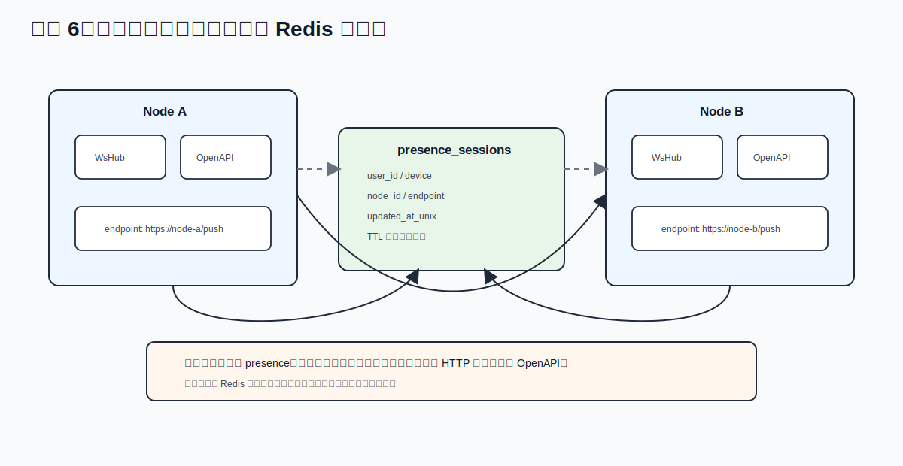
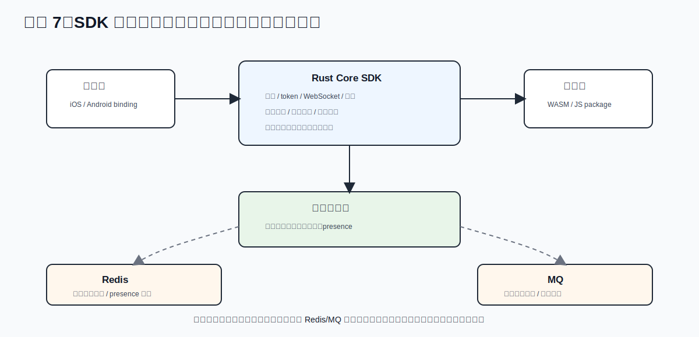

# 用 Rust 做一个无 Redis/MQ 依赖的 IM 后端：基于数据库实现集群、实时与同步

代码开源在: https://github.com/restsend/restsend-rs

大家可以添加我的微信: jinti2000

很多 IM 系统默认会引入两类基础设施：

- Redis：做在线状态、路由表、短期缓存
- MQ：做异步投递、解耦、削峰

这套方案成熟，但也会带来额外的运维复杂度与成本。我尝试用一种更“克制”的实现：

- 后端主语言是 Rust
- 实时链路使用 WebSocket
- 能力面包含 OpenAPI（服务端调用）与 UserAPI（终端调用）
- 有完整的会话与消息同步机制
- 集群协作主要依赖数据库，不强依赖 Redis/MQ
- SDK 已成熟，可集成到 App 与网页


## 目标

一个可落地的 IM 后端，最小要满足四件事：

1. 在线实时：用户在线时消息尽量实时到达
2. 离线可补：断线重连后可按序补齐
3. 多端一致：同一账号多设备收敛为同一状态
4. 可集群化：多节点部署后，路由与投递仍可工作

把“数据库”当成唯一强依赖，用它承接：

- 消息持久化（消息日志）
- 会话状态（每用户会话元数据）
- 在线会话索引（presence sessions）



这一步的关键不是“少用组件”，而是先确定系统的正确性边界。实时推送可以失败，HTTP 转发可以超时，客户端也可能断线；但只要消息日志、会话状态和同步锚点在数据库里是可靠的，系统就有恢复路径。

这个设计的优点很朴素，也很有力量：

- 实时链路只负责体验，不背负最终一致性的全部压力
- 离线补偿变成一条明确路径，而不是到处散落的补丁逻辑
- 多端一致性可以围绕同一份会话状态收敛
- 集群路由先用数据库共享事实，避免一开始就引入额外基础设施

换句话说，数据库不是被迫承担所有事情，而是只承担“必须正确”的部分；内存结构和节点间调用则承担“尽量快”的部分。这个分工让系统在早期保持克制，也给后续扩展留下清晰接口。

## 分层设计：API、领域服务、基础设施

### API 分层

常见会拆成三层入口：

- WebSocket：实时上行（聊天、已读、输入态）与实时下行（推送）
- UserAPI：终端侧业务 API（会话列表、聊天同步、资料、群组等）
- OpenAPI：服务端对服务端 API（用户管理、发消息、群管控、运营动作）

这样分层的价值是鉴权边界清晰：

- UserAPI 以用户令牌为主
- OpenAPI 可支持平台级 token，或复用用户 token
- WebSocket 走握手鉴权后进入长连接会话

### 领域服务

核心服务通常是：

- ChatService：发消息、回执、撤回、消息同步
- ConversationService：会话读写、未读、置顶/免打扰、清空语义
- TopicService：群与成员关系
- AuthService/UserService：身份与账号生命周期

### 基础设施

无 Redis/MQ 时，基础设施关键在三块：

- WsHub：本节点内存态连接管理
- PresenceHub/PresenceStore：在线会话存储（内存或数据库）
- EventBus + TaskPool：进程内异步事件总线和工作池

这里的核心思想是：

- 节点内的实时性，交给内存结构（低延迟）
- 节点间的可见性，交给数据库（可共享）
- 节点内解耦，不必上 MQ，也能先用进程内总线跑起来



这套分层的精巧处在于它没有把“入口协议”和“业务语义”混在一起。WebSocket、UserAPI、OpenAPI 都可以触发消息或状态变化，但它们进入领域服务后应该复用同一套业务规则。这样可以避免一个常见问题：WebSocket 发消息是一套逻辑，HTTP 发消息又是一套逻辑，最后线上出现难以解释的状态分叉。

分层后，每一层都有清晰职责：

- API 层负责鉴权、协议适配、请求形状和错误返回
- 领域服务负责消息、会话、群组、关系这些稳定语义
- 基础设施负责连接、presence、事件分发、任务池和外部调用
- 数据库负责可恢复状态，而不是充当临时消息队列

这样的结构读起来也更轻：当你排查一个问题时，可以先判断它属于协议入口、业务状态、实时投递还是持久化，而不是在一个巨大的“消息处理函数”里追踪所有副作用。

## WebSocket 实时链路



WebSocket 链路的设计目标不是“保证所有消息都只靠长连接送达”，而是尽量降低在线用户的感知延迟。它应该快、轻、可丢通知但不可丢状态。

### 连接建立

连接建立时通常要确定：

- userId
- device
- 可选 nonce（用于区分同设备多连接）

接入后执行两步注册：

1. 注册到 WsHub（本机内存）
2. upsert 到 PresenceStore（可选数据库后端）

随后开始心跳续约：按 heartbeat 周期刷新 presence TTL。

这里有一个重要细节：本机 WsHub 和数据库 PresenceStore 是两种不同性质的状态。WsHub 代表“这个进程现在真的握着哪些连接”，用于低延迟投递；PresenceStore 代表“集群里哪些设备大概率在线”，用于跨节点路由。前者追求即时，后者追求共享，两者不应该互相替代。

参考代码可以长这样。连接建立或心跳到来时，把 userId/device 写入 presence 表；如果已经存在，就只刷新 nodeId、endpoint 和更新时间：

```rust
async fn upsert_session(&self, user_id: &str, device: &str) -> Result<(), sea_orm::DbErr> {
	let now = chrono::Utc::now().timestamp();

	if let Some(existing) = presence_session::Entity::find_by_id((
		user_id.to_string(),
		device.to_string(),
	))
	.one(&self.db)
	.await?
	{
		let mut active = existing.into_active_model();
		active.node_id = Set(self.node_id.clone());
		active.endpoint = Set(self.endpoint.clone());
		active.updated_at_unix = Set(now);
		active.update(&self.db).await?;
		return Ok(());
	}

	presence_session::ActiveModel {
		user_id: Set(user_id.to_string()),
		device: Set(device.to_string()),
		node_id: Set(self.node_id.clone()),
		endpoint: Set(self.endpoint.clone()),
		updated_at_unix: Set(now),
	}
	.insert(&self.db)
	.await?;

	Ok(())
}
```

### 上行消息处理

典型上行类型：

- chat：发送消息
- read：已读上报
- typing：输入态
- ping：保活

为避免单连接打爆业务线程，一般做两层限制：

- 每用户速率限制（例如令牌节流）
- 每连接发送队列上限（bounded channel）

当下行通道背压严重时，可按策略主动剔除慢连接，优先保证系统整体吞吐。

这个限制看起来像保护措施，实际是 IM 系统稳定性的基本盘。一个慢客户端不应该拖慢整个节点，一个恶意或异常设备也不应该占满业务线程。bounded channel、速率限制和慢连接剔除，让实时链路成为可控资源，而不是无限缓冲区。

### 下行投递

下行分两类：

- 本地投递：直接写入 WsHub 对应用户/设备通道
- 远端投递：根据数据库里的在线会话记录，把消息转发到目标节点的 OpenAPI 推送端点

这就是“无 Redis 路由”的关键：

- 用 presence_sessions 表代替 Redis 在线路由表
- 用节点间 HTTP 调用代替 MQ 广播

这里的取舍很清楚：节点间投递可能没有 MQ 那样强的削峰能力，但它足够直接、可观测、容易排障。对于中小规模集群，HTTP 转发加数据库路由往往比先搭一整套消息基础设施更容易落地。

## 消息模型与同步语义



消息系统最怕语义含糊：到底谁决定顺序、客户端从哪里补、推送失败算不算丢消息。这里用 topic 内 seq 作为唯一同步锚点，把问题压缩成一个简单模型：只要客户端知道自己的 lastSeq，就可以继续向后补齐。

### 消息持久化

每条消息至少包含：

- topicId（会话/群）
- chatId（业务消息 ID）
- seq（会话内单调序号）
- senderId
- createdAt
- content（结构化内容）

其中 seq 是同步锚点，决定“从哪里补”。

消息日志应尽量接近不可变事实。撤回、删除、已读这类动作可以作为状态变更或附加字段处理，但不应该破坏消息链的可追溯性。这样做的好处是同步接口、审计逻辑、离线恢复都围绕同一条主链工作。

这里还有一个我认为最核心的原则：IM 最重要的是不丢消息，所以收到消息后必须先入库，入库成功后才能给客户端 resp。哪怕后面的 WebSocket 通知失败、跨节点推送失败、webhook 失败，消息也已经在数据库里，客户端可以靠同步接口补回来。

因此客户端最好生成自己的 msgId（在这里对应 chatId）再发送。客户端没有收到 resp 时，可以用同一个 msgId 重传；服务端可以用 msgId 做幂等约束或冲突识别，最终通过同步接口确认这条消息是否已经进入消息日志。这个模型比“我已经推送出去了所以算成功”更稳，因为成功的定义落在数据库持久化上，而不是落在网络通知上。

参考代码里，主链路就是先写 chat_logs，再更新会话，最后发布事件。只有这些数据库相关动作成功后，API 才会返回 resp；后面的推送只是副作用。为了突出顺序，下面省略了鉴权、参数校验和 topic 解析细节：

```rust
pub(crate) async fn send_chat_message(
	state: &AppState,
	user_id: &str,
	mut form: OpenApiChatMessageForm,
) -> Result<(OpenApiChatMessageForm, String, OpenApiSendMessageResponse), ApiError> {
	if form.r#type.is_empty() {
		form.r#type = "chat".to_string();
	}

	let topic_id = resolve_topic_id(state, user_id, &form).await?;
	let resp = state
		.chat_service
		.send_to_topic(&topic_id, user_id, &form)
		.await
		.map_err(map_domain_error)?;

	update_topic_conversations(state, &topic_id, &resp, &form).await;
	state.event_bus.publish(BackendEvent::Chat(ChatEvent {
		topic_id: topic_id.clone(),
		sender_id: user_id.to_string(),
		chat_id: resp.chat_id.clone(),
		seq: resp.seq,
		created_at: form.created_at.clone().unwrap_or_else(|| Utc::now().to_rfc3339()),
		content: form.content.clone(),
	}));

	Ok((form, topic_id, resp))
}
```

这个顺序很重要：resp 表示“服务端已经接受并持久化”，不表示“所有在线设备都已经收到通知”。通知失败时，客户端看到的只是实时性下降，不应该变成数据丢失。

### 幂等、seq 与排序

IM 里容易混淆两个 ID：客户端生成的 msgId，以及服务端分配的 seq。它们解决的是两个不同问题：

- msgId/chatId 解决“这是不是同一条用户意图”
- seq 解决“这条消息在会话里排第几”

客户端重试时应该复用同一个 msgId。服务端看到相同 msgId 时，不应该生成第二条逻辑消息，而应该返回已有结果，或者至少让客户端可以通过同步接口确认这条消息已经存在。工程上可以把唯一约束放在全局 chatId，或者 topicId + chatId 上；关键是不要把“网络重试”变成“重复发消息”。

seq 则必须由服务端生成。客户端时间、客户端本地自增 ID、HTTP 到达顺序都不能作为最终排序依据。多设备、多节点、弱网络下，唯一可靠的排序方式是：消息入库时在 topic 维度分配单调 seq，客户端渲染时按 seq 收敛。createdAt 更适合做展示时间，不适合作为强排序锚点。

所以我更倾向把消息发送拆成三个语义层：

1. msgId：客户端意图与重试幂等
2. seq：服务端会话内顺序
3. sync：客户端最终收敛

这个拆分很小，但能避免大量 IM 系统里的边界问题。客户端可以乐观展示本地消息，但最终状态必须以服务端返回的 seq 或同步结果为准。

### 撤回不是删除，而是可同步的状态变更

recall 也应该放在同一套语义里理解。撤回不应该简单删除消息行，否则离线客户端、审计逻辑和多端同步都会失去参照。更稳的做法是：

- 找到原始消息，校验 topic、chatId、senderId
- 把原消息标记为 recalled，并把内容替换为 recalled 状态
- 再追加一条 recall 类型的消息，拿到新的 seq
- 在线客户端通过推送看到撤回，离线客户端通过同步看到同样结果

参考代码里，recall 不是绕开消息日志的特殊通道，而是先更新原消息，再走同一个 send_internal 追加一条事件消息：

```rust
pub async fn recall_in_topic(
	&self,
	topic_id: &str,
	sender_id: &str,
	form: &OpenApiChatMessageForm,
) -> DomainResult<OpenApiSendMessageResponse> {
	let recall_chat_id = form
		.content
		.as_ref()
		.map(|content| content.text.trim())
		.filter(|value| !value.is_empty())
		.ok_or_else(|| DomainError::Validation("recall chat id is required".to_string()))?;

	let target = chat_log::Entity::find()
		.filter(chat_log::Column::TopicId.eq(topic_id.to_string()))
		.filter(chat_log::Column::Id.eq(recall_chat_id.to_string()))
		.filter(chat_log::Column::SenderId.eq(sender_id.to_string()))
		.one(&self.db)
		.await?
		.ok_or_else(|| DomainError::Validation("recall target not found".to_string()))?;

	if target.recall {
		return Err(DomainError::Validation("recall target already recalled".to_string()));
	}

	let mut target_active = target.into_active_model();
	target_active.recall = sea_orm::ActiveValue::Set(true);
	target_active.content_json = sea_orm::ActiveValue::Set(
		serde_json::to_string(&Content {
			content_type: "recalled".to_string(),
			..Content::default()
		})
		.map_err(|err| DomainError::Validation(err.to_string()))?,
	);
	target_active.update(&self.db).await?;

	self.send_internal(Some(topic_id.to_string()), sender_id, None, form).await
}
```

这里的精华是：撤回也进入 seq 序列。客户端不是靠“某个瞬时通知”理解撤回，而是靠可同步的消息序列和消息状态理解撤回。这样多端、离线、重连之后的视图才会一致。

### 会话内顺序保证

在不引入外部序列服务时，可用数据库乐观并发生成 seq：

- 读取 topic 当前 lastSeq
- 条件更新 lastSeq = lastSeq + 1（where lastSeq = old）
- 成功则拿到新序号，失败重试

优点：

- 不依赖 Redis INCR
- 顺序语义在单 topic 维度可控

代价：

- 热门大群会有竞争重试
- 需要控制重试次数和退避

这个方案的优雅点在于它把“全局顺序”降级成“会话内顺序”。大多数 IM 业务并不需要全站消息全局有序，只需要一个 topic 内消息可按序同步。范围缩小后，数据库乐观并发就足以承担早期序列分配。

参考代码里，seq 的分配没有依赖 Redis INCR，而是对 topic 的 lastSeq 做条件更新。只有当前 lastSeq 没被其他并发请求改掉时，本次更新才成功：

```rust
async fn next_topic_seq(&self, topic_id: &str) -> DomainResult<i64> {
	for _ in 0..5 {
		let current = topic::Entity::find_by_id(topic_id.to_string())
			.one(&self.db)
			.await?
			.ok_or(DomainError::NotFound)?;

		let current_seq = current.last_seq;
		let update = topic::Entity::update_many()
			.col_expr(topic::Column::LastSeq, Expr::col(topic::Column::LastSeq).add(1))
			.filter(topic::Column::Id.eq(topic_id.to_string()))
			.filter(topic::Column::LastSeq.eq(current_seq))
			.exec(&self.db)
			.await?;

		if update.rows_affected > 0 {
			return Ok(current_seq + 1);
		}

		tokio::time::sleep(std::time::Duration::from_millis(20)).await;
	}

	Err(DomainError::Conflict)
}
```

它的代价也诚实：热门大群会让同一行 lastSeq 成为热点。好在这个热点边界非常明确，后续可以单独对超大群做分片、批量序列或专门广播优化，而不必重写普通会话逻辑。

### 增量同步

终端同步通常用：

- lastSeq + limit 拉取
- 返回 items + hasMore + next anchor

断线恢复路径：

1. WebSocket 负责“尽量实时”
2. REST 同步接口负责“最终补齐”

这让系统不依赖“消息必达推送”，而是“推送 + 拉取兜底”的组合。

这也是整个无 MQ 架构成立的关键：可靠性不是由投递通道单独保证，而是由持久化日志和同步协议共同保证。推送只负责提醒客户端“有新东西”，同步接口负责确认“缺了哪些东西”。

同步接口的参考写法也很直接：先读取用户在该会话上的 startSeq，再从消息日志里按 topic 拉取，最后过滤掉用户不可见的消息。这样“清空会话”“单人删除”等用户视角状态，不会破坏消息主链：

```rust
pub async fn chat_sync(
	State(state): State<AppState>,
	auth: AuthCtx,
	Path(topic_id): Path<String>,
	Json(form): Json<ChatLogSyncForm>,
) -> ApiResult<Json<ChatLogSyncResult>> {
	let start_seq = state
		.conversation_service
		.get_conversation(auth.user_id(), &topic_id)
		.await
		.ok()
		.map(|conv| conv.start_seq)
		.unwrap_or_default();

	let result = state
		.chat_service
		.topic_logs(&topic_id, &form)
		.await
		.map_err(map_domain_error)?;
	let items = result
		.items
		.into_iter()
		.filter(|item| item.seq > start_seq)
		.map(|mut item| {
			if item.deleted_by.iter().any(|v| v == auth.user_id()) {
				item.content = Content::default();
			}
			item
		})
		.collect();

	Ok(Json(ChatLogSyncResult { items, ..result }))
}
```

## 会话层设计：为什么消息和会话要分离



很多团队一开始会把“会话列表”直接从消息表聚合，后期会遇到瓶颈。更稳妥的做法是独立会话表，按 ownerId + topicId 存一份用户视角状态：

- unread
- lastReadSeq
- startSeq（清空历史后的可见起点）
- sticky/mute/remark
- lastMessage 摘要

这样会得到两个好处：

- 会话列表查询复杂度稳定，不需每次扫消息表
- 用户个性化状态（免打扰、备注、清空）不污染消息主链

更深入地看，消息表和会话表回答的是两个完全不同的问题：

- 消息表回答“这个 topic 中发生了什么”
- 会话表回答“这个用户现在如何看待这个 topic”

把这两个问题拆开之后，很多功能会自然变简单。清空会话不需要删除消息，只需要移动 startSeq；已读不需要改写消息日志，只需要更新 lastReadSeq；置顶、免打扰、备注也只是用户视角状态，不会影响其他成员。

这也是会话列表性能稳定的原因。列表页面对的是 ownerId 维度的用户视角查询，天然适合走 owner_id + updated_at 索引；消息同步面对的是 topicId + seq 的顺序扫描。两个访问模式分开建模，数据库索引才不会互相迁就。

## 7. OpenAPI 与 UserAPI 的边界

### 7.1 UserAPI

面向终端，强调“用户身份上下文”：

- 会话列表/会话详情
- 聊天发送与同步
- 资料、关系、拉黑

### 7.2 OpenAPI

面向业务后端，强调“平台控制能力”：

- 用户创建/授权/更新
- 代发消息、群管理、批量操作
- 运营动作与自动化编排

边界清晰后，可把 App 前端和业务后端并行演进，不互相锁死。

这里的设计重点是“能力相似，但身份不同”。UserAPI 和 OpenAPI 都可能读取用户、创建会话、发送消息，但它们的信任来源不一样：UserAPI 代表终端用户本人，OpenAPI 代表接入方服务端或平台运营能力。

把边界拆开有三个实际收益：

- 权限模型更容易审计，不会把用户 token 和平台 token 混在一起
- 业务服务端可以独立接入 OpenAPI，不需要模拟终端行为
- SDK 可以专注终端状态机，不必暴露平台管理语义

这让系统对外看起来清楚：终端做用户该做的事，业务后端做平台该做的事，WebSocket 只承接实时连接。

## 8. 集群实现：不依赖 Redis/MQ 的关键机制



### 8.1 在线路由共享

每个连接在数据库登记一行 presence：

- userId
- device
- nodeId
- endpoint
- updatedAtUnix

节点按 TTL 清理过期会话。任何节点要给某用户推送时：

- 查 presence 表拿在线设备所在 endpoint
- 本节点直接推本地连接
- 非本节点走 HTTP 转发到目标节点

这个机制的关键是 presence 只表达“近期在线且位于哪个节点”，不表达消息可靠性。它是一张路由提示表，而不是消息队列。即使 presence 短暂过期、误判或转发失败，消息仍在 chat_logs 里，客户端同步仍能修复结果。

跨节点投递的参考代码如下：先从 presence_sessions 查目标用户的在线设备，过滤掉本节点 endpoint，剩下的走节点间 OpenAPI 推送。这里没有发布订阅，也没有 MQ fanout，只有数据库路由和一次普通 HTTP 调用：

```rust
async fn push_remote_user_now(
	state: &AppState,
	user_id: &str,
	device: Option<&str>,
	payload: &str,
) {
	if state.config.presence_backend != "db" || state.config.endpoint.is_empty() {
		return;
	}

	let cutoff = chrono::Utc::now().timestamp() - state.config.presence_ttl_secs as i64;
	let mut query = presence_session::Entity::find()
		.filter(presence_session::Column::UserId.eq(user_id.to_string()))
		.filter(presence_session::Column::UpdatedAtUnix.gte(cutoff));

	if let Some(device) = device {
		query = query.filter(presence_session::Column::Device.eq(device.to_string()));
	}

	let Ok(rows) = query.all(&state.db).await else {
		return;
	};

	for row in rows {
		if row.endpoint.trim().is_empty() || row.endpoint == state.config.endpoint {
			continue;
		}

		let _ = send_remote_push(state, &row.endpoint, &row.user_id, &row.device, payload).await;
	}
}
```

因此数据库路由的压力是可理解的：连接建立、心跳续约、清理过期、投递前查询。它比 Redis 慢，但胜在少一个组件、少一套数据一致性问题，适合节点规模还没有大到需要专门路由缓存的阶段。

### 8.2 事件解耦

站内事件（消息发送、已读、会话更新、群事件）先通过进程内 EventBus 扇出到：

- 推送任务池
- webhook 任务池
- 监控打点

这在单体到小规模集群阶段足够实用，不必过早上 MQ。

进程内 EventBus 的价值是让主链路保持短：消息落库和会话更新完成后，推送、webhook、指标这些副作用可以进入不同任务池。它不是 MQ 的完整替代品，但能先把代码结构解耦出来，让后续替换成 MQ 时有自然边界。

这里可以充分利用 Rust/Tokio 的 broadcast channel。数据库变更完成后发布一个领域事件，订阅方各自处理 webhook、消息推送、监控等副作用。主链路只关心事件有没有被发布出去，不需要知道后面有几个消费者：

```rust
#[derive(Clone)]
pub struct EventBus {
	sender: broadcast::Sender<BackendEvent>,
}

impl EventBus {
	pub fn new(buffer_size: usize) -> Self {
		let (sender, _) = broadcast::channel(buffer_size.max(64));
		Self { sender }
	}

	pub fn publish(&self, event: BackendEvent) {
		let event_name = event.event_name();
		if let Err(err) = self.sender.send(event) {
			tracing::warn!(event = event_name, error = %err, "event bus publish failed");
		}
	}

	pub fn subscribe(&self) -> broadcast::Receiver<BackendEvent> {
		self.sender.subscribe()
	}
}
```

webhook worker 只需要订阅这个事件流，再把事件转换成 HTTP payload。消息推送也可以走同样的事件边界。这样一来，“数据库变更”是主事实，“事件发布”是架构解耦点，“webhook/推送”是可失败、可重试、可替换的下游能力。

### 8.3 失败与恢复

无 MQ 方案最怕“瞬时失败丢通知”。对策是把一致性责任放在同步接口：

- 推送失败不会丢数据，因为消息已落库
- 客户端重连后按 lastSeq 补齐

也就是说，实时链路是性能层，数据库同步是正确性层。

这个原则让失败处理变得好读：

- WebSocket 失败：客户端重连并同步
- 远端节点转发失败：目标客户端稍后同步
- webhook 失败：任务池重试或记录失败，不影响消息主链
- presence 过期：下一次连接或心跳重新登记

每类失败都有自己的恢复路径，而不是都堆到一个“保证投递成功”的复杂机制里。

## 9. SDK 成熟度与跨端集成价值



当后端能力稳定后，SDK 的价值不是“封装 HTTP”，而是“封装状态机”：

- 登录与 token 生命周期
- WebSocket 重连与心跳
- 本地会话/消息缓存
- 增量同步与冲突收敛

Rust Core + 多端绑定（如 WASM、移动端绑定）有两个现实好处：

- 业务逻辑在多端复用，减少协议分叉
- 同步策略一致，线上行为更可预测

因此它可以较平滑地接入：

- 自有 App（iOS/Android）
- 自有网页（WASM/JS）
- 混合场景（管理后台 + 客服工作台 + 用户端）

SDK 成熟后，后端协议的复杂性不会直接暴露给每个业务客户端。客户端只需要面对更稳定的概念：登录、连接、会话、消息、同步、重连。至于 WebSocket 什么时候断、lastSeq 怎么推进、本地缓存什么时候刷新，都可以收进 SDK 状态机。

这对 IM 系统尤其重要，因为多端行为的一致性很难靠文档约束。把同步策略沉到 Rust Core，再通过 WASM、移动端绑定复用，可以减少协议分叉，也能让线上问题更容易复现和修复。

## 10. 性能与容量考量

无 Redis/MQ 并不等于不能扩展，而是把扩展点前置设计好：

- 数据库索引：topicId + seq、ownerId + updatedAt
- 工作池隔离：消息、推送、webhook 分池
- 背压控制：WS 队列上限、慢消费者剔除
- 批量同步：batch sync 降低 RTT

容量上通常会先碰到两类热点：

- 超大群写入导致 seq 争用
- 海量在线时 presence 读写压力

应对策略：

- 群分层（超大群走广播优化或分片）
- presence 表冷热分离、短 TTL、必要时分库

这部分设计的精巧点在于热点位置是可预期的。topicId + seq 是消息同步热点，ownerId + updatedAt 是会话列表热点，presence 的 userId/device 和 nodeId/updatedAtUnix 是在线路由热点。只要热点清楚，容量规划就不是盲目加机器，而是围绕具体访问模式做索引、分片和缓存。

无 Redis/MQ 的阶段尤其要重视三个指标：

- seq 重试次数：用于判断是否出现热门 topic 写入竞争
- presence 写入和清理延迟：用于判断在线路由是否拖慢数据库
- 同步接口 P95/P99：用于判断离线补偿是否仍然可靠

## 11. 什么时候应该引入 Redis/MQ

这套架构不是“永远不用 Redis/MQ”，而是“在以下阈值前不必强依赖”：

- 节点规模仍可通过数据库路由承载
- 推送失败可由同步兜底接受
- 业务可容忍毫秒到秒级最终一致

当出现以下信号，可以渐进引入：

- 节点间消息转发成为瓶颈
- 跨地域广播与削峰需求明显
- 大规模事件流需要持久消费与回放

演进路径可保持兼容：

1. 先保留数据库为真相源
2. 再引入 Redis 做热点缓存/路由加速
3. 最后引入 MQ 承接高吞吐异步流

这里的重点是“渐进引入”，不是推翻重来。Redis 可以先作为 presence_sessions 的热点缓存，而数据库仍保留真相；MQ 可以先承接 webhook、推送、事件流，而消息日志仍是同步真相源。这样引入新组件时，系统只是多了一层加速或削峰能力，不会把正确性语义迁移到更难排查的异步链路里。

## 12. 总结

一个工程上可用的 Rust IM 后端，并不一定要从 Redis/MQ 起步。

只要把职责分清：

- WebSocket 负责实时体验
- 数据库存储负责正确性
- 同步接口负责最终补偿
- OpenAPI/UserAPI 负责边界治理

就能在较低系统复杂度下，做出可集群、可扩展、可被 SDK 稳定集成到 App/网页的 IM 基座。

这不是“省略组件”的投机，而是“按阶段控制复杂度”的架构策略。
